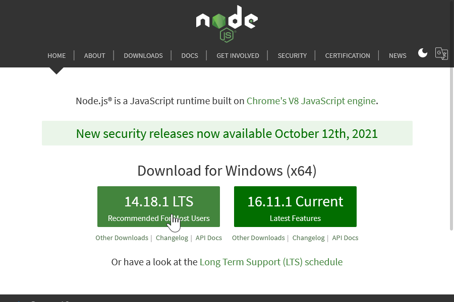
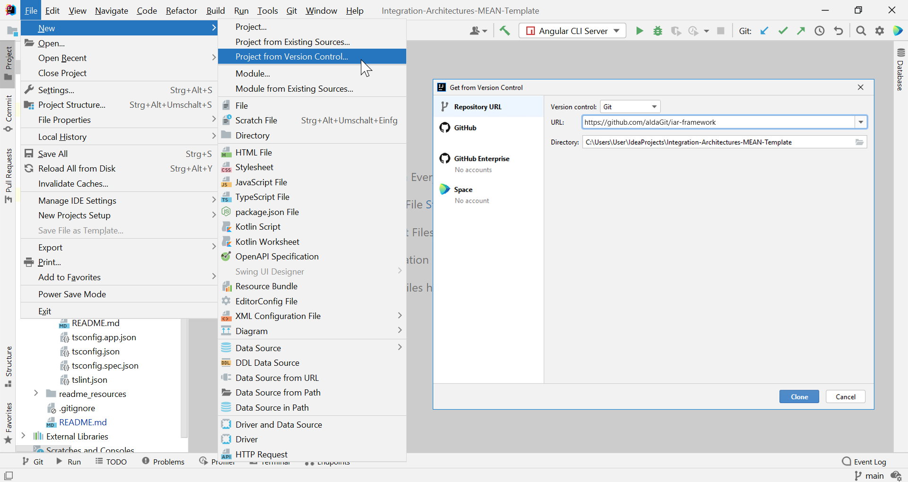
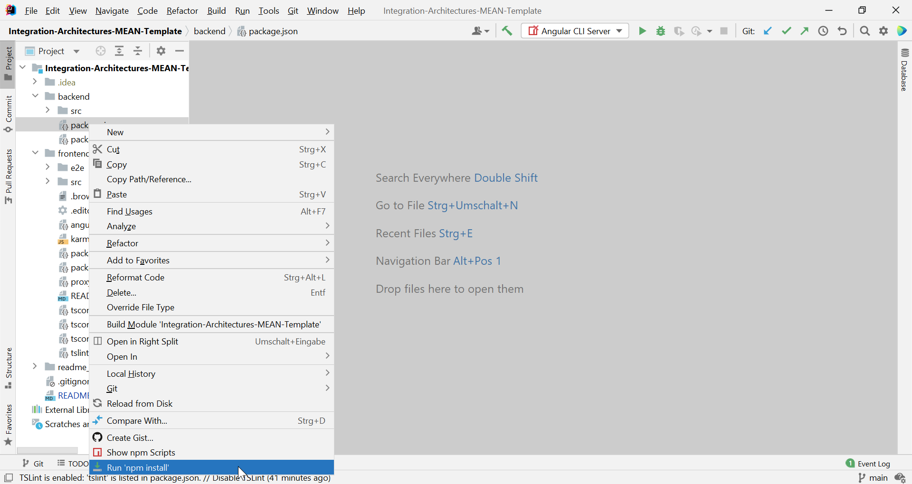

# Integration-Architectrues-MEAN-Template

This template is meant to support students getting started with the Integration Architectures project.

## Prerequisites
 1. You need a Node.js runtime. It is available at: https://nodejs.org/ .
    
    Please download a version >14.x.x (The current LTS version 14.18.x works, but also the newest version 16.11.x should
    be fine).
 
    __!!! Important: On Windows (and maybe also other operating systems) it is necessary to reboot the device after this
    step, to refresh the PATH and make `node` commands available in shell.__

 2. Access to a MongoDB server is necessary. If you don't have one already, you should download the community server at:
    https://www.mongodb.com/try/download/community .
    
    Upon installation, I would recommend you to select, that MongoDB
    Compass should also be installed. It's a nice GUI-application for managing MongoDB Servers and Databases.

## Setup
You can use your favourite IDE to work on your applications. But please note, that our examples mostly cover the IDEs from 
Jetbrains (IntelliJ, WebStorm etc.).

 1. **Cloning this git repository**

    You need to clone this repository. This can simply be done through your IDE or using git bash.
    
    In the IDEs from Jetbrains git repositories can be cloned by selecting *File > New > Project from Version Control* (Shown on the left of the screenshot).
    Also, there is a "Get from VCS" button on the welcome-screen, when no project is opened.
    Either way a dialog is displayed (shown on the right), where you can paste the URL and clone it.
   
    Alternatively git bash can be used. Simply type/paste this at the desired location:

    `git clone https://github.com/LUC4R4T0R/Integration-Architectrues-MEAN-Template`

 2. **Installing dependencies**

    The dependencies of this software can be installed with node package manager (npm). Both front- and backend need to be
    handled separately. 
    
    
    In IntelliJ and Webstorm you can just right-click the `package.json` file and select "Run 'npm install'" to install
    the dependencies.  Alternatively you navigate to the location of the `package.json` inside your shell and then run `npm install`.
      
    __Either way, this has to be done both in the directory `frontend/` and `backend/`.__

## Launching the Applications

For both front- and backend there ar run scripts included in their `package.json`.
So you can just start them by running `npm run start` in their respective directories.

After they are done starting, the frontend can be reached from your browser at: http://localhost:4200/

You can log in with username *admin* and the password, which is printed out to the console output of the backend.
 **!!! Attention: The password will only be printed on the first startup (e.g. when no user is present in the database). So please write it down!**